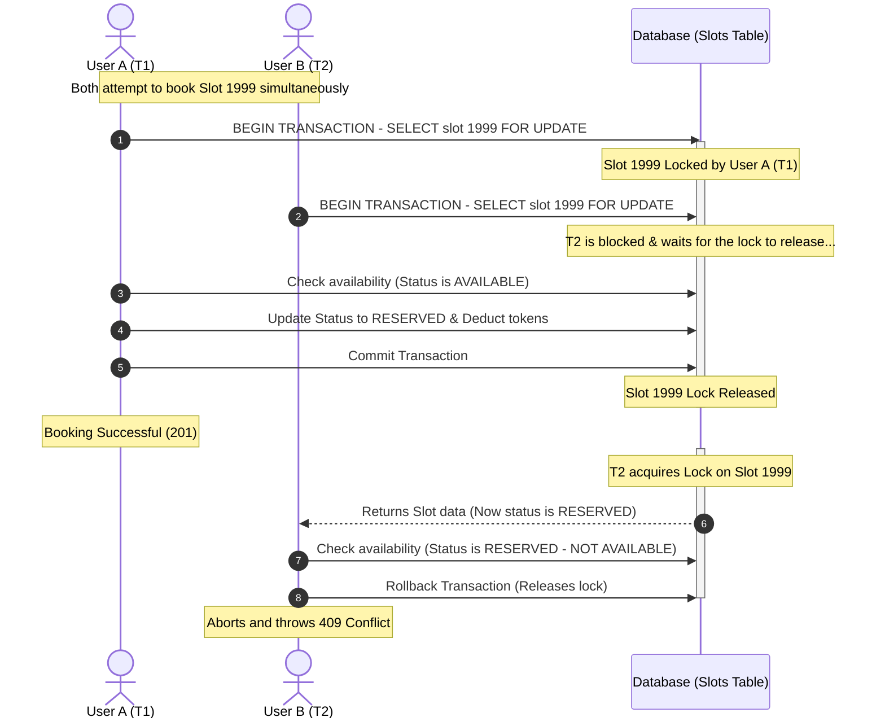

# Concurrency Control: Pessimistic Locking with `SELECT ... FOR UPDATE`

This document outlines the control flow and locking mechanism implemented to prevent double-booking of facility slots under high concurrency.

## Sequence Flow Diagram

## Detailed Control Flow

1. **Simultaneous Requests**: Multiple users send requests to book the exact same slot at the exact same moment.
2. **First to the Lock (`T1`)**: The first database transaction that successfully executes the query containing `.with_for_update()` immediately acquires an **exclusive row-level lock** on the queried slots.
3. **Queueing (`T2` & `T3`)**: Any other transactions trying to query the same slots with `FOR UPDATE` are blocked at the database engine level and wait.
4. **T1 Processing**:
   * Application verifies the slot's status. Since it's the first, the slot status is `AVAILABLE`.
   * The slot is updated to `RESERVED` and the user's tokens are deducted.
   * `T1` commits. This automatically releases the exclusive lock.
5. **T2/T3 Resumes**:
   * Once the lock is released, the next queued transaction (e.g. `T2`) resumes and retrieves the slot data.
   * Because `T1` committed, `T2` now reads the updated database state, seeing the slot status as `RESERVED`.
   * The application logic checks the status. Since it is no longer `AVAILABLE`, the application raises an `HTTP 409 Conflict` exception and rolls back the transaction.
