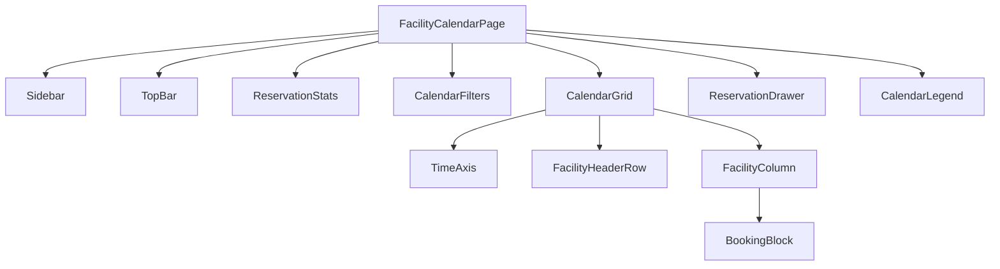
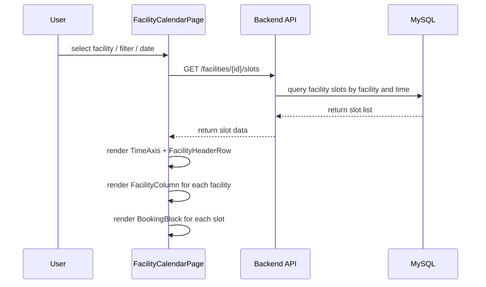
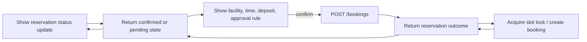
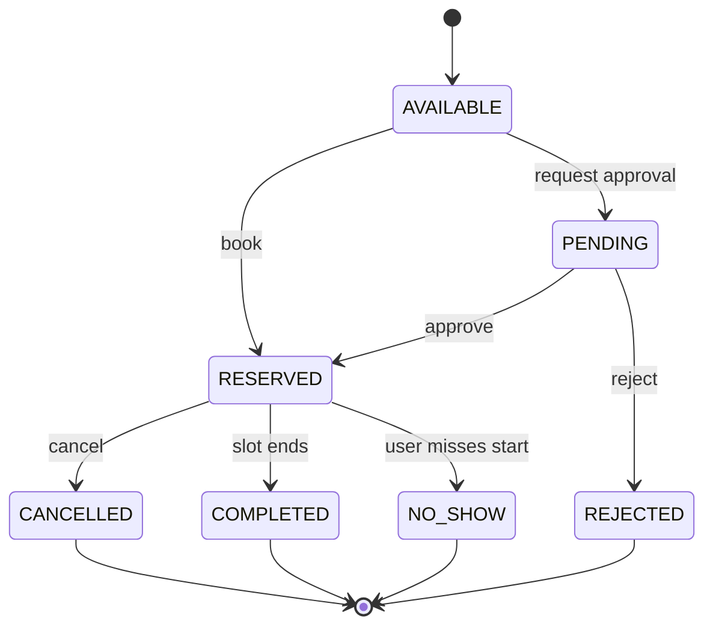

# Tables and Flow Diagrams

This document summarizes the frontend Calendar module with tables and mermaid flow diagrams, following the facility-first design for the Campus Facility Reservation System.

## 1. Frontend Information Architecture

| Layer | Component | Responsibility |
|---|---|---|
| Navigation | `Sidebar` | Collapsible menu with navigation links only; no booking logic. |
| Top Controls | `TopBar` | Date navigation, search, filters, and quick actions. |
| Workspace | `CalendarGrid` | Renders facility rows and time columns. |
| Workspace | `TimeAxis` | Fixed left axis with 5-minute increments from 07:00 to 17:00. |
| Workspace | `FacilityHeaderRow` | Displays facility groups and names along the Y-axis. |
| Workspace | `FacilityColumn` | Displays slot cells for one facility across the day. |
| Slot UI | `BookingBlock` | Shows reservation status, duration, deposit, and approval state. |
| Interaction | `ReservationDrawer` | Side drawer for booking details and confirmation. |
| Status | `CalendarLegend` | Shows slot color mapping and booking state definitions. |
| Filters | `CalendarFilters` | Facility type, available-only, my reservations, and approval state filters. |

## 2. Layout Comparison

| Option | Orientation | Primary axis | Best for | Drawback |
|---|---|---|---|---|
| Facility-first | Rows = Facilities, Columns = Time | Facility | Resource reservation systems | Less familiar to people calendars users |
| Person-first | Rows = Days, Columns = Time | Day | Employee schedule management | Not ideal for facility availability scanning |

## 3. Booking Color System

| Status | Label | Color |
|---|---|---|
| AVAILABLE | Available | Green |
| RESERVED | Reserved | Blue |
| PENDING | Pending Approval | Orange |
| UNAVAILABLE | Unavailable | Red |
| MY_BOOKING | My Booking | Purple |
| PAST | Past Slot | Gray |

## 4. Suggested Component Hierarchy

## 5. Calendar Grid Flow

## 6. Booking Request Flow

## 7. Slot State Transition Diagram

## 8. UX Decision Matrix

| Requirement | Design Decision | Outcome |
|---|---|---|
| Facility visibility | Fix facilities on Y-axis | Users compare all rooms/courts at once |
| Availability scanning | Time on X-axis with 5-minute ticks | Fine-grained search and fast booking |
| Fast booking | Click slot → side drawer | Minimal interruption and quick confirmation |
| Conflict prevention | Real-time slot refresh + approval awareness | Avoid double-booking and surprise conflicts |
| Token awareness | Status strip shows token balance | Users see cost before booking |
| Approval awareness | Pending color and request label | Users understand approval flow immediately |

## 9. Implementation Notes

- The sidebar must remain purely navigation and should not contain booking logic.
- The reservation drawer is preferred over a modal for quicker review and context retention.
- Use group labels for `Courts`, `Classrooms`, `Labs`, and `Halls`.
- Keep the top toolbar and status strip visible, with filters and search on the right.
- The grid should allow independent scroll for facility list and time columns.
