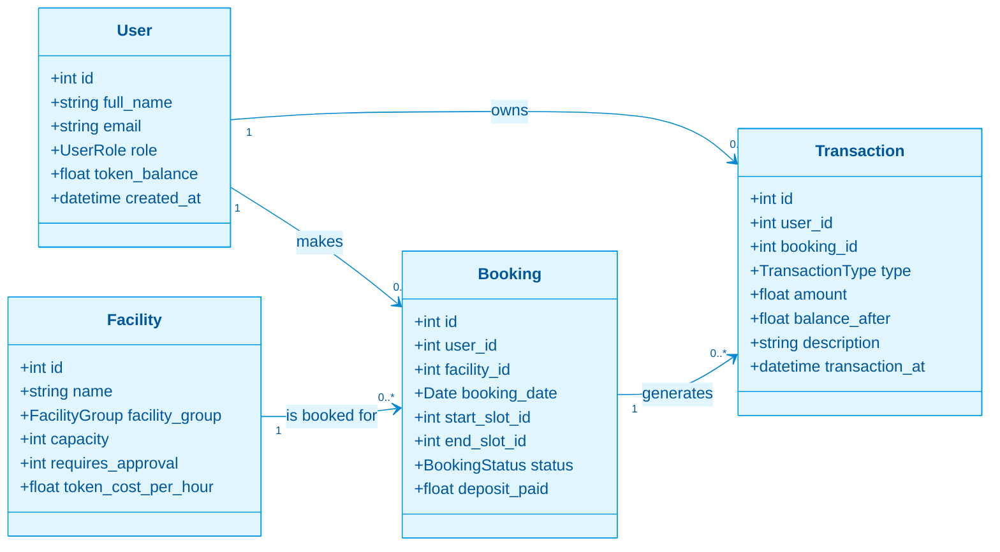
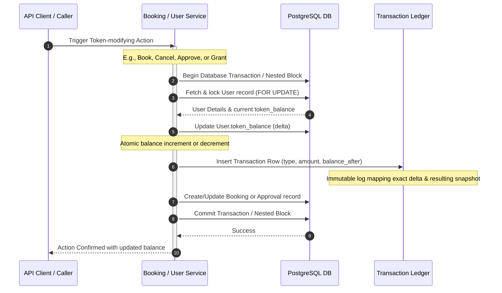
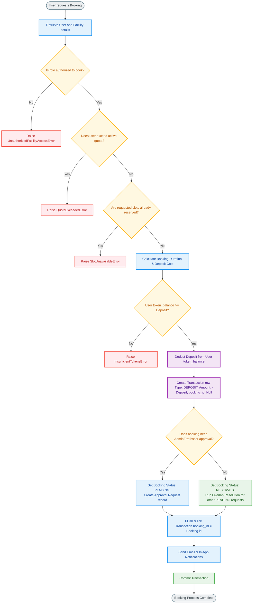
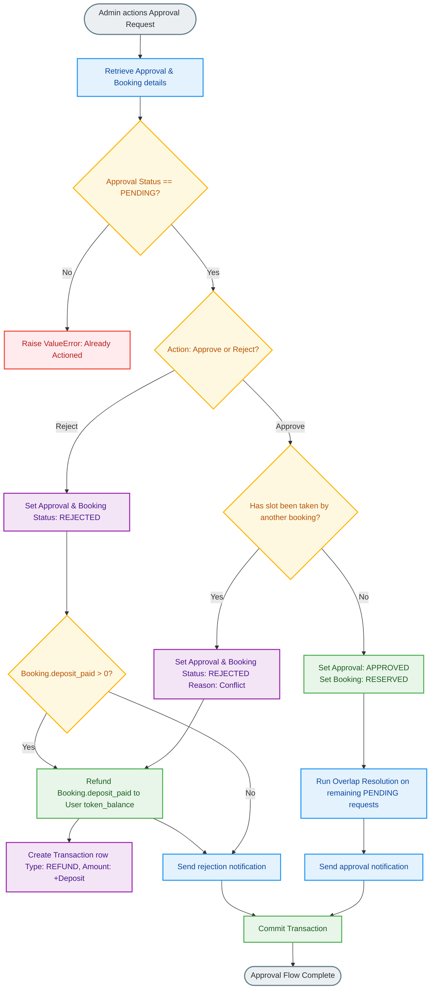
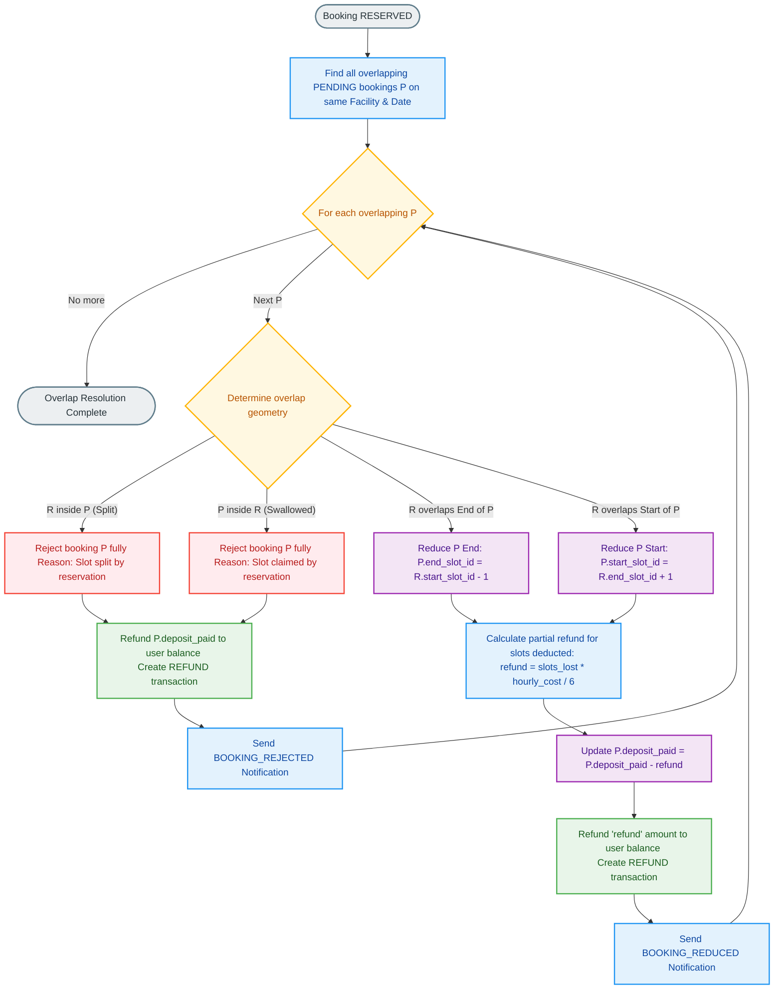
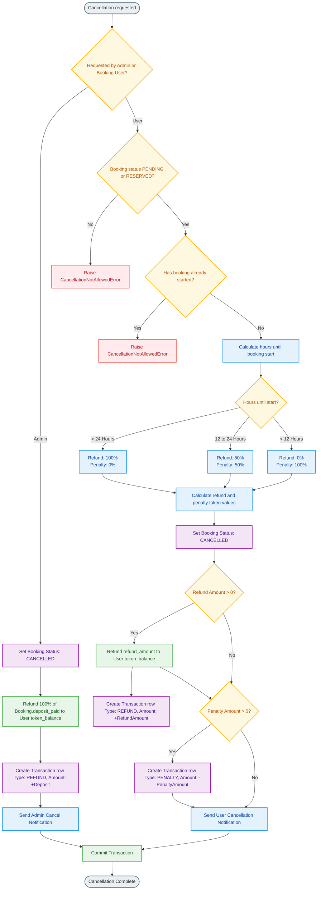
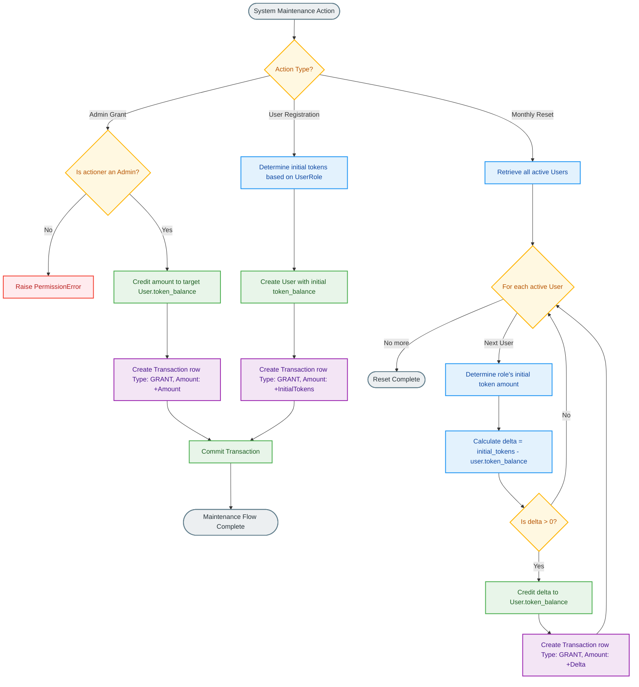
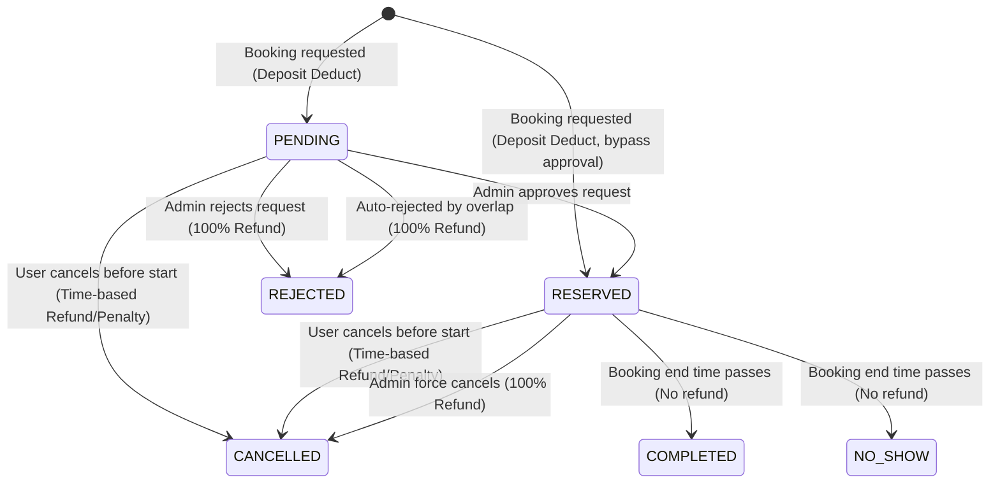

# Token System Architecture: Facility Reservations

This document details the architecture, data flows, and transaction lifecycle of the token-based reservation system used to book campus facilities. 

> [!NOTE]
> This system is a **virtual currency ledger** used to allocate facility hours, manage demand, and enforce cancellation policies. It is entirely separate from authentication tokens (e.g., JWT).

---

## 1. Core Data Models & Token Fields

The token architecture is supported by four primary database models in [models.py](file:///home/remitpe/MAIN/InternshipProject_2/backend/app/db/models.py). The integrity of the system is maintained by ensuring that any change to a user's token balance is mirrored by an immutable record in the transaction ledger.

### Key Components

1. **User Balance (`User.token_balance`)**: Tracks the current spendable virtual tokens. Initial grants are based on the user's role:
   - **Student**: 5 tokens
   - **Professor**: 20 tokens
   - **Admin**: 999 tokens
2. **Facility Cost Rate (`Facility.token_cost_per_hour`)**: Defines the hourly rate of the space. Every 10-minute slot consumed is valued at $\frac{1}{6}$ of this rate.
3. **Booking Deposit (`Booking.deposit_paid`)**: The total tokens held in escrow at the time the booking is requested.
4. **Ledger Record (`Transaction`)**: An immutable record tracking every token movement. 
   - **Types**: `GRANT`, `DEPOSIT`, `REFUND`, `PENALTY`, `DEDUCTION`.
   - Contains a snapshot of the user's balance (`balance_after`) immediately following the transaction.

---

## 2. Ledger Consistency Pattern (Atomic Transactions)

To guarantee that the user's current token balance always matches the ledger history, all token modifications are wrapped in database transactions using SQLAlchemy's atomic updates. 

---

## 3. Booking Creation & Token Deduction Flow

When a user attempts to book a facility, the system performs a sequence of verification steps before deducting tokens. 

The deposit calculation is:
$$\text{Deposit} = \text{Facility Cost Per Hour} \times \left( \text{Number of Slots} \times \frac{10}{60} \right)$$

This value is rounded to **2 decimal places** to prevent floating-point discrepancies.

---

## 4. Approval, Rejection & Overlap Conflict Workflow

For bookings that enter the `PENDING` state, an administrator or professor must action the approval request. If a slot is booked by an automatically confirmed reservation before the pending request is processed, the system triggers an automatic refund conflict sequence.

---

## 5. Geometric Overlap Resolution & Partial Refunds

When a booking transitions to the `RESERVED` status, it resolves conflicts with any overlapping `PENDING` bookings for the same facility and date. The pending bookings are either completely rejected or dynamically truncated.

Let $R$ represent the newly reserved booking interval, and $P$ represent the pending booking interval.

---

## 6. Booking Cancellation: Refunds & Penalties

Cancellations handle token refunds and penalties based on the time remaining before the booking starts.

### Refund & Penalty Percentages
- **Cancellation requested > 24 hours prior**: 100% refund, 0% penalty.
- **Cancellation requested between 12 and 24 hours prior**: 50% refund, 50% penalty.
- **Cancellation requested < 12 hours prior**: 0% refund, 100% penalty.

---

## 7. Token Administration & Reset Flows

Admins have the authority to grant tokens manually. In addition, the system runs a **Monthly Token Reset** scheduler to replenish user balances according to their roles.

---

## 8. Completion & No-Show Lifecycles

After a reserved booking slot passes, the status changes to either `COMPLETED` or `NO_SHOW`. No tokens are refunded in either of these cases:

- **COMPLETED**: The user successfully attended the reservation. The deducted tokens represent the paid usage fee.
- **NO_SHOW**: The user failed to attend the reservation. The deducted tokens are kept in full as a penalty.

