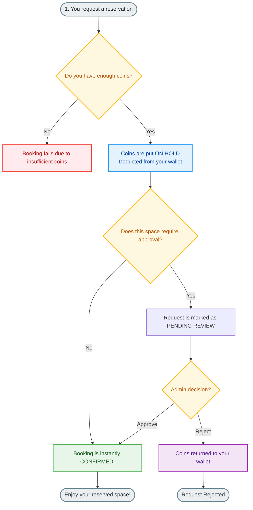
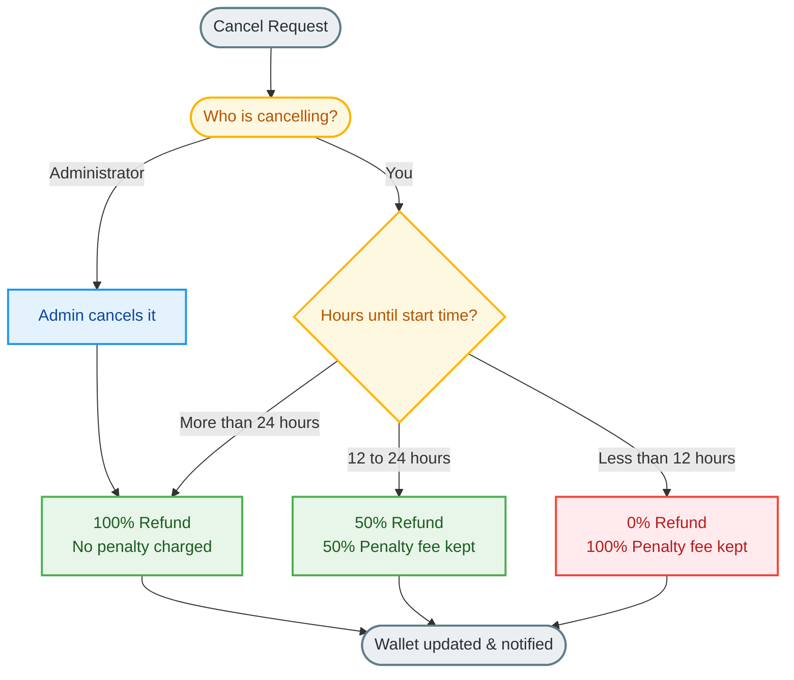

# Campus Booking Coins: A Simple Guide to the Token System

This guide explains how the booking coin (token) system works for reserving campus spaces. It is designed for students, professors, and facility administrators.

---

## 1. What is the Token System?

Think of it like a **Virtual Token Wallet** for reserving rooms, courts, or labs. Instead of using real money, you use booking coins to make reservations. This ensures everyone gets a fair share of campus facilities.

### Your Monthly Token Allowance

Every active user starts with a monthly coin allowance depending on their role:

| Role | Initial Coins | Typical Usage |
| :--- | :---: | :--- |
| 🎓 **Students** | **5 coins** | Booking group study rooms or sports courts. |
| 👨‍🏫 **Professors** | **20 coins** | Booking lecture halls or research labs. |
| 🛠️ **Administrators** | **999 coins** | Unlimited utility for administrative scheduling. |

> [!TIP]
> **The Monthly Top-Up Rule:**
> At the start of every month, if your balance is below your role's allowance, the system will top it up back to the initial amount. If you have saved more than your initial allowance, you keep all of your extra coins!

---

## 2. Booking a Space (How Coins are Spent)

Every space has an hourly cost in coins (e.g., 1 coin per hour). When you create a booking:

1. **Calculate Cost**: The system calculates the reservation cost down to the exact 10-minute slot.
2. **Deduct & Hold (Escrow)**: The calculated cost is placed **on hold** (deducted from your wallet balance).
3. **Approval Rules**:
   - If a booking is **instantly confirmed**, the coins are fully claimed.
   - If a booking requires **approval**, your coins are held. If the request is rejected, the coins are returned to your wallet.

---

## 3. What Happens If Bookings Clash? (Auto-Adjustments)

Sometimes, multiple people request the same room at overlapping times while their requests are pending. When one booking gets approved and confirmed, the system automatically resolves the conflicts:

* **Complete Block**: If the approved booking completely covers your time, your booking is **canceled**, and you receive a **100% refund** of your coins.
* **Partial Overlap (Shortening)**: If the approved booking only blocks part of your requested time (like the first 20 minutes), the system automatically **shortens your booking** to the free times, and **refunds you for the canceled minutes**!

---

## 4. Cancelling a Booking (Refunds & Penalty Rules)

If your plans change, you can cancel your reservation. To prevent people from holding spaces they won't use, refund amounts are based on **how early you cancel**:

---

## 5. End of Booking (Completion vs. No-Show)

Once a reserved booking time is over:

* **If you attended (Completed)**: The booking is successfully marked complete. The coins remain spent as the usage fee for the space.
* **If you missed it (No-Show)**: If you fail to show up, the booking is marked as a No-Show. **No coins are refunded**. The coins are kept in full as a penalty for blocking the space.
