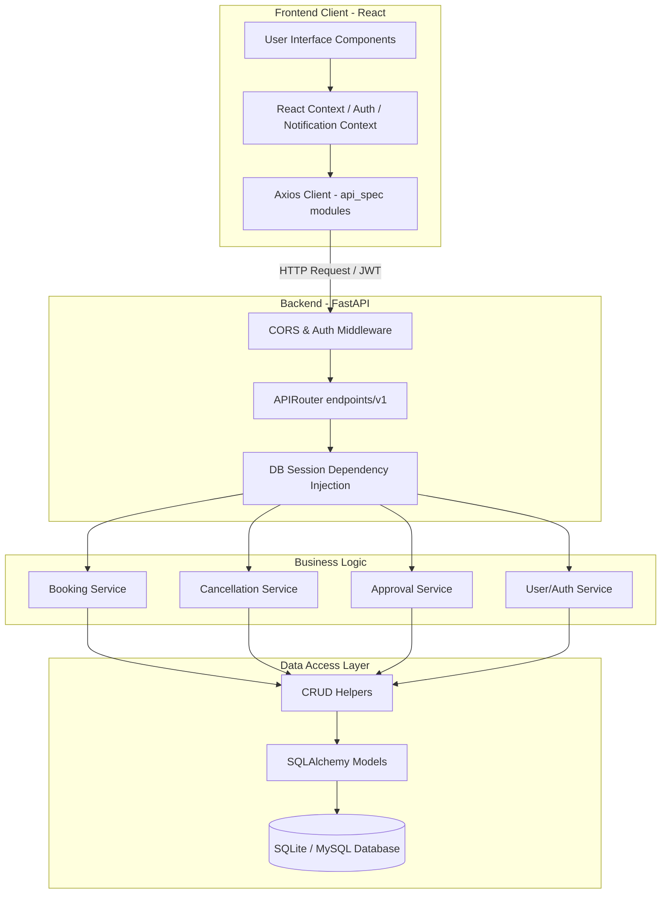
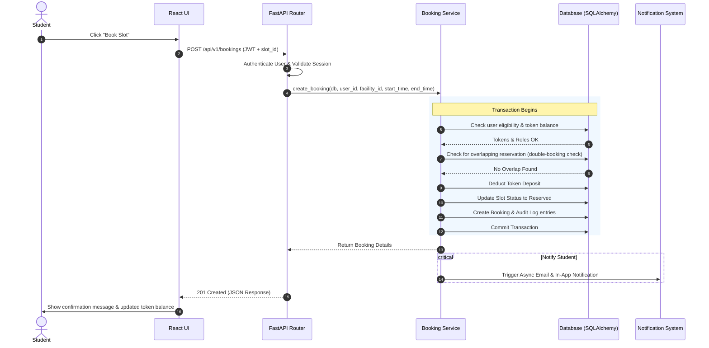
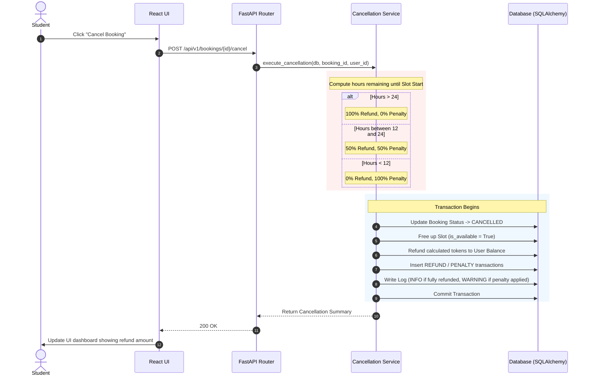

# Architectural Details & Flow Diagrams

This document details the software architecture, the request-response cycle, and integration flows between the React frontend client and the FastAPI backend server.

## Architectural Diagram

The application adheres to a Clean Layered Architecture:

---

## Architectural Flow Diagram: Creating a Booking

This flow diagram illustrates the end-to-end request-response cycle when a student attempts to reserve a facility slot:

---

## Cancellation Processing Flow

This diagram outlines how cancellation refunds and penalties are computed and processed when a student cancels a booking:

