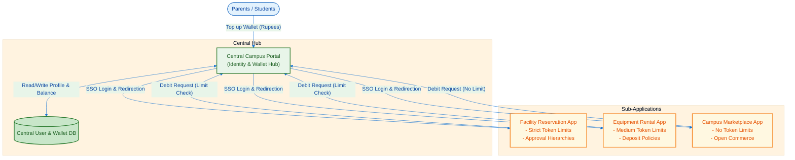
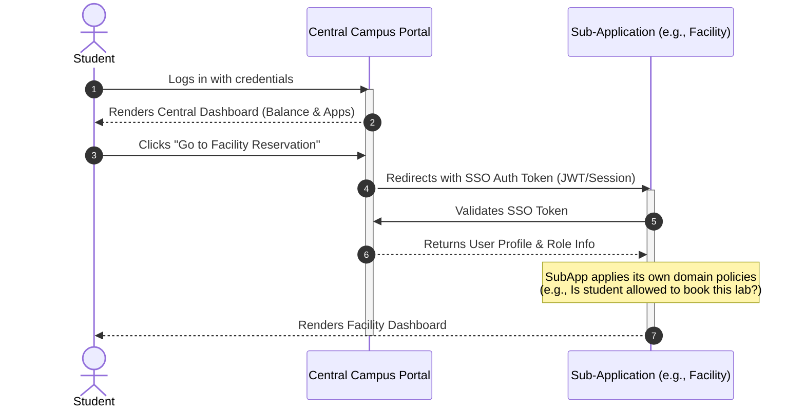
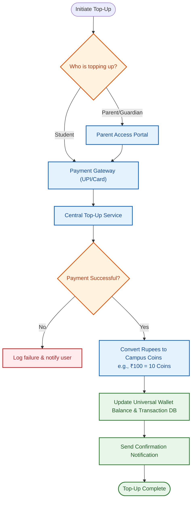
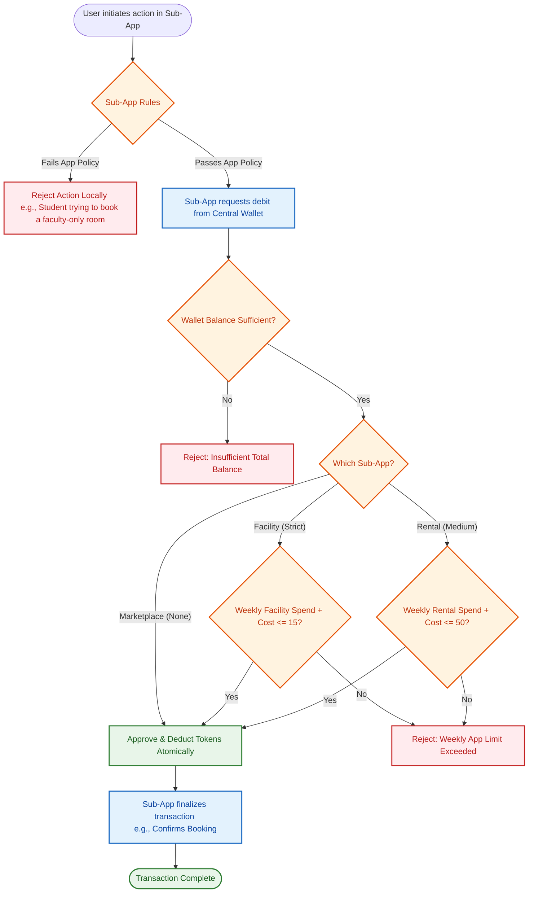

# Centralized Campus Portal: Model-1 Integration Specification

This document details the complete integration architecture of the four campus applications using the **Universal Token System (Model 1)**.

## 1. System Architecture Overview

The system transitions to a Hub-and-Spoke model. A new **Central Campus Portal** acts as the central hub managing user identity, profiles, and the universal coin wallet. The three existing projects operate as independent sub-applications that rely on the central hub for authentication and token balances, while enforcing their own domain-specific business rules.

---

## 2. User Journey & Redirection Flow

Users (Students, Professors, Admins) log into the Central Campus Portal. Upon successful authentication, they access a dashboard displaying their universal token balance and links to the sub-applications. 

When a user navigates to a sub-application, they are seamlessly authenticated via Single Sign-On (SSO). The sub-application fetches their profile and role to apply its specific policies.

---

## 3. Wallet & Top-up Flow

The top-up system allows parents, guardians, or students to deposit Rupees into their central account. These are instantly converted into Universal Campus Coins.

---

## 4. Sub-Application Policies & Token Exhaustion Limits

While the tokens are universally available in the user's central wallet, expenditure limits are enforced by the Central Hub based on the requesting sub-application. Additionally, each sub-application enforces its own behavioral policies.

### A. Central Token Limits (Model 1 Rules)
- **Campus Facility Reservation**: Strict Weekly Limit (e.g., Max 15 coins/week).
- **Campus Equipment Rental**: Medium Weekly Limit (e.g., Max 50 coins/week).
- **Campus Marketplace**: No Limit (Exhaustive up to full wallet balance).

### B. Application-Specific Policies
- **Profile Portability**: The central profile carries the user's `Role` (Student, Professor, Admin).
- **Facility Reservation Policies**: Enforces hierarchical approval workflows (Students need approval, Professors bypass). Enforces overlapping booking auto-cancellations.
- **Equipment Rental Policies**: Enforces deposit holding, late-return penalties, and condition-based refund policies.

