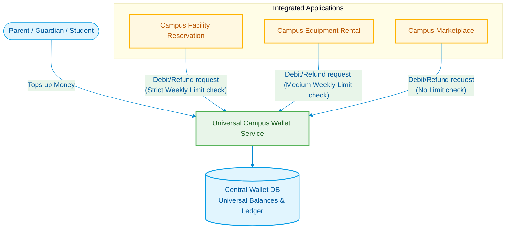
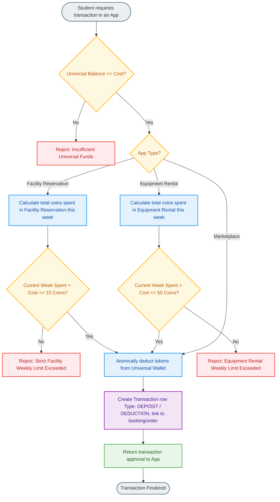

# Integration Model 1: Universal Campus Token System

This document outlines the architecture, transaction logic, and system integration flow for the **Universal Campus Token Model** (Model-1). 

In this model, a single universal token (Campus Coin) is shared across all campus applications, funded by a central parent-topped account, and controlled by weekly spending limits per application.

---

## 1. System Architecture Overview

Under the Universal model, a centralized **Campus Wallet Service** manages a single database ledger for all student accounts. The three campus applications interface with this service via secure API calls to authorize and record transactions.



---

## 2. Universal Balance & Expenditure Rules

### Funding the Wallet
- Parents, guardians, or students can top up the **Central Wallet** with fiat currency (money) at any point in the month.
- Money is instantly converted to a single universal token balance at a fixed exchange rate (e.g., ₹100.00 Rupee = 10 Campus Coins).

### Cross-App Expenditure Limits
To prevent over-allocation of tokens to non-essential activities and ensure fair sharing of resource facilities, the system enforces **weekly expenditure limits** depending on the application context:

| Application | Limit Type | Weekly Limit Amount | Rationale |
| :--- | :--- | :---: | :--- |
| **3. Facility Reservation** | **Strict Exhaustive** | **15 Coins / week** | Prevents single students from monopolizing study rooms, gyms, or labs. |
| **2. Equipment Rental** | **Medium Exhaustive** | **50 Coins / week** | Allows students to rent necessary laptops, project kits, or cameras but caps misuse. |
| **1. Campus Marketplace** | **No Limit** | **Unlimited** | Essential for purchasing meals, textbooks, and academic supplies. |

---

## 3. Transaction Flow with Weekly Limit Verification

Whenever a student makes a purchase, the target application queries the central database. If the target application has an expenditure limit, the wallet service checks the user's spending ledger for the **current week** (defined as the start of Monday UTC to the current timestamp) to verify if the transaction is allowed.



---

## 4. API Schema Extension Requirements

To integrate our Facility Reservation database with the Central Wallet Service, the current transaction table should be adapted. 

```sql
-- Extends the existing transactions schema to support cross-app scopes
ALTER TABLE transactions ADD COLUMN app_source VARCHAR(50) DEFAULT 'facility_reservation';
ALTER TABLE transactions ADD COLUMN external_reference_id VARCHAR(100);

-- Query to calculate weekly spending for Facility Reservation
SELECT SUM(ABS(amount)) 
FROM transactions 
WHERE user_id = :user_id 
  AND type = 'DEPOSIT' 
  AND app_source = 'facility_reservation'
  AND transaction_at >= date_trunc('week', current_timestamp);
```

### Advantages of Model 1
* **Seamless User Experience**: Students manage only a single coin balance.
* **Unified Parent Portal**: Parents top up a single master wallet instead of handling multiple micro-wallets.
* **Granular Dynamic Budgets**: Focuses security controls on usage constraints (spending limits) rather than allocation constraints.
