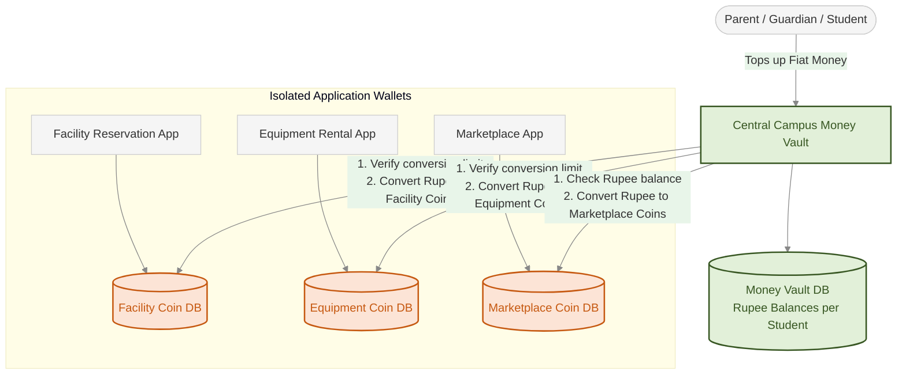
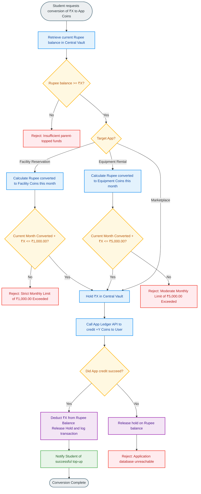

# Integration Model 2: Separated Token System with Conversion Limits

This document outlines the architecture, conversion rules, and integration flows for the **Separated Application Token Model** (Model-2). 

In this model, each campus application manages its own independent coin database. Rather than restricting weekly expenditures, spending is regulated at the entry point: by enforcing strict **conversion limits** when exchanging topped-up money into application-specific coins.

---

## 1. System Architecture Overview

Under the Separated model, there is a central **Campus Money Vault** (retaining fiat currency loaded by parents/guardians) and three isolated application wallets. Coins are non-transferable between applications.



---

## 2. Independent Wallets & Conversion Limits

Students request conversions from their Central Money Vault into the respective application coins. To prevent excessive allocation of funds to specific services, conversion caps are strictly enforced:

| Target Application | Coin Name | Conversion Limit Tier | Monthly Conversion Limit | Conversion Rate |
| :--- | :--- | :---: | :---: | :---: |
| **3. Facility Reservation** | **Facility Coins** | **Strict Limit** | **Max ₹1,000.00 / month** | ₹10.00 = 10 Facility Coins |
| **1. Equipment Rental** | **Equipment Coins** | **Moderate Limit** | **Max ₹5,000.00 / month** | ₹10.00 = 10 Equipment Coins |
| **2. Campus Marketplace** | **Marketplace Coins** | **No Limit** | **Unlimited** (Up to money exhaustion) | ₹10.00 = 10 Marketplace Coins |

### Key Rule Constraints
- **Unused coins are locked**: Once Rupee is converted into Facility Coins or Equipment Coins, they **cannot** be converted back to Rupee or transferred to another application.
- **Conversion Limits Reset**: The monthly conversion counters reset to ₹0.00 spent on the first day of each calendar month.

---

## 3. Atomic Conversion & Limit Verification Flow

To prevent database desynchronization, the exchange of fiat money for application-specific coins must be processed as a **two-phase commit** across both databases:



---

## 4. Integration Database Extensions

To manage conversion limits, the **Central Campus Money Vault** must maintain a log table of monthly conversion quotas per user:

```sql
CREATE TABLE user_monthly_conversion_quotas (
    id SERIAL PRIMARY KEY,
    user_id INT NOT NULL,
    month_year DATE NOT NULL, -- e.g., '2026-06-01'
    facility_converted_rupee NUMERIC(10, 2) DEFAULT 0.00,
    equipment_converted_rupee NUMERIC(10, 2) DEFAULT 0.00,
    UNIQUE(user_id, month_year)
);
```

### Advantages of Model 2
* **Database Isolation**: If the Facility Reservation database goes offline, students can still buy food at the Marketplace without system lockouts.
* **Tight Financial Control**: Parents can rest assured that money topped up cannot be accidentally fully blown on booking facility rooms, restricting waste at the source.
* **Simpler Reconciliation**: Account ledgers are kept clean and specific to each application team's domain.
