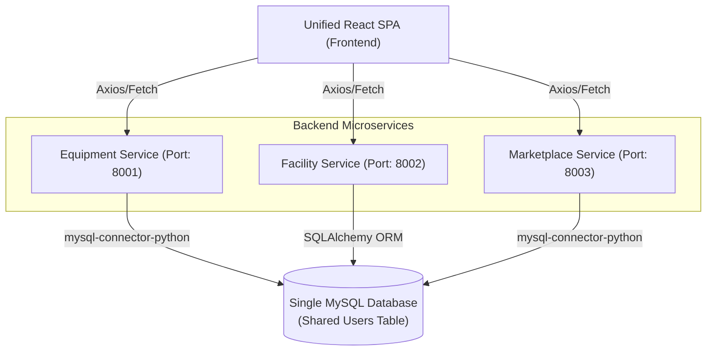

# Final Architecture & Execution Plan

This document formalizes the finalized architecture for the `Main-Centralized-Application` and provides the immediate actionable steps to get the integration running.

## 1. Architectural Overview

We are adopting a **Microservices Backend with a Single-Page Application (SPA) Frontend** pattern. 

### Architecture Flowchart



### Key Decisions
1. **Single Database:** A single shared MySQL database server for all three microservices. The `users` table will be merged so users only have one account across the entire campus system.
2. **Multiple Backends:** 3 independent FastAPI microservices (Equipment, Facility, Marketplace) running on separate ports. No API Gateway is needed.
3. **Single Frontend:** 1 unified React application serving as the central hub. The frontend will make API requests directly to the respective microservice ports.

---

## Quick approach

Here are the immediate, actionable steps to get the integration running:

### Step 1: Set up the Backend Structure
- Inside `Main-Centralized-Application`, create a `backends/` folder.
- Manually copy the three existing backend folders into it:
  - `Campus-Equipment-Rental/backend` -> `backends/equipment`
  - `Campus-Facility-Reservation-System/backend` -> `backends/facility`
  - `Campus-Secure-Marketplace-System/backend` -> `backends/marketplace`

### Step 2: Reconfigure Ports
- Open the `main.py` or uvicorn configuration for each of the three backends.
- Change them to run on distinct ports so they can run concurrently:
  - Equipment -> `8001`
  - Facility -> `8002`
  - Marketplace -> `8003`

### Step 3: Database Unification
- Create a single database (e.g., `campus_central_db`) in your MySQL server.
- Review the `users` table schema from all three projects and create a single unified `users` table.
- Update the database connection strings (in `.env` files or `database.py` files) in all three microservices to point to `campus_central_db`.

### Step 4: Initialize the Frontend
- Scaffold a single new React/Vite app in `Main-Centralized-Application/frontend` (e.g., using `npx create-vite@latest frontend --template react`).
- Configure its `.env` file to hold the URLs for the three separate backends:
  ```env
  VITE_EQUIPMENT_API_URL=http://localhost:8001
  VITE_FACILITY_API_URL=http://localhost:8002
  VITE_MARKETPLACE_API_URL=http://localhost:8003
  ```
- Begin building the central App Shell (Navigation Sidebar) to route between the different feature sets.
