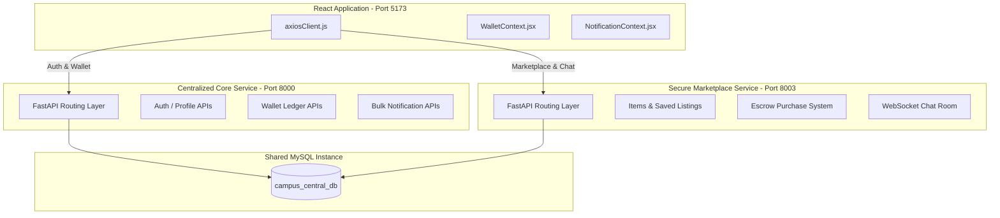

# Centralized Core & Marketplace System Integration Report

This document specifies the integration of the Centralized Core and Marketplace backends with the React frontend.

---

## 1. System Integration Overview

The integration separates core campus features (user profiles, auth, wallet ledgers, notifications) from domain-specific features (marketplace listings, transaction escrows, web sockets chat) into two microservice backends, maintaining frontend compatibility.



---

## 2. Decoupled Database Design

The database table schemas are divided between the services:

### Core Tables (Managed via SQLAlchemy)
Created dynamically using `Base.metadata.create_all` via [`init_db.py`](file:///home/remitpe/MAIN/InternshipProjectIntegration/backends/centralized_core/init_db.py):
*   `users`: Store login credentials, email domains, verification flags, and last seen timestamps.
*   `admin_users`: Internal system administration credentials.
*   `wallets`: Ledger balance tracker with locked tokens and reserved limits.
*   `transactions`: Ledger transaction history containing manual top-ups and purchase logs.
*   `notifications`: Unified notifications table containing user-scoped alert feeds.

### Marketplace Tables (Managed via SQL Bootstrapper)
Created via [`schema.sql`](file:///home/remitpe/MAIN/InternshipProjectIntegration/backends/marketplace/schema.sql):
*   `items`: Marketplace product listings (status: `available`, `reserved`, `sold`).
*   `saved_items`: Product bookmarks/saved lists for students.
*   `holding_records`: Escrow holding vaults locking funds during delivery confirmations.
*   `messages`: Persistent chat history records between buyers and sellers.

### Seeded Credentials (Student A & Student B)
Database initialization seeds mock students using `@mail.com` domains:
*   **Student A (Buyer):**
    *   Username: `student1`
    *   Email: `student1@mail.com`
    *   Password: `password123`
    *   Balance: `500.00` tokens
*   **Student B (Seller):**
    *   Username: `student2`
    *   Email: `student2@mail.com`
    *   Password: `password123`
    *   Balance: `500.00` tokens

---

## 3. Backend API Specifications

Both services mount routers aligned with the React Axios client. All responses return Pydantic objects formatted under nested JSON envelopes (`{"data": ...}`).

### Centralized Core (Port 8000)

| Endpoint | Method | Input Payload | Response Wrapper | Description |
| :--- | :--- | :--- | :--- | :--- |
| `/users/register` | `POST` | `UserCreate` | `UserResponseWrapper` | Registers user + initializes wallet |
| `/users/login` | `POST` | `LoginRequest` | `LoginResponseWrapper` | Authenticates and returns JWT token |
| `/users/me` | `GET` | *Bearer Token* | `UserResponseWrapper` | Returns profile of authenticated user |
| `/wallet/balance` | `GET` | *Bearer Token* | `WalletResponse` | Returns current token balances |
| `/wallet/topup` | `POST` | `TopupRequest` | `TransactionResponse` | Deposits tokens and appends transaction |
| `/wallet/history` | `GET` | *Bearer Token* | `List[TransactionResponse]` | Returns all ledger transactions |
| `/api/notifications/` | `GET` | *Bearer Token* | `List[NotificationResponse]` | Retrieves notifications feed |
| `/api/notifications/{id}/read` | `PATCH` | *Bearer Token* | `NotificationResponse` | Marks a notification as read |
| `/api/notifications/read-all` | `PATCH` | *Bearer Token* | `Success` | Marks all active notifications as read |
| `/api/notifications/read` | `DELETE` | *Bearer Token* | `Success` | Clears read notifications |

### Secure Marketplace (Port 8003)

| Endpoint | Method | Input Payload | Response Wrapper | Description |
| :--- | :--- | :--- | :--- | :--- |
| `/marketplace/items/` | `GET` | *Optional filters* | `SuccessWrapper` | Returns all available listings |
| `/marketplace/items/` | `POST` | `ItemCreate` | `ItemResponse` | Lists a new item for sale |
| `/marketplace/items/{id}` | `GET` | *Bearer Token* | `ItemResponse` | Retrieves details for a specific item |
| `/marketplace/items/saved` | `GET` | *Bearer Token* | `SuccessWrapper` | Returns user's bookmarked listings |
| `/marketplace/items/{id}/save` | `POST` | *Bearer Token* | `SuccessWrapper` | Bookmarks a specific listing |
| `/marketplace/transactions/purchase` | `POST` | `PurchaseRequest` | `PurchaseResponse` | Locks buyer tokens in escrow vault |
| `/marketplace/delivery/confirm/{id}` | `POST` | *Bearer Token* | `DeliveryConfirmResponse` | Releases escrow tokens to seller |
| `/marketplace/chat/conversations` | `GET` | *Bearer Token* | `SuccessWrapper` | Returns list of chat rooms |
| `/chat/ws/{item_id}` | `WS` | *WebSocket* | *Payload frames* | Real-time messaging stream |

---

## 4. Frontend Integration Overhaul

Both communication utilities are updated from client-side mock variables to communicate with the backend endpoints:

1.  **Wallet Management Context (`WalletContext.jsx`):**
    *   Disabled hardcoded balance definitions.
    *   Wired up `fetchWallet` to fetch `/wallet/balance` and `/wallet/history` in parallel using `authClient`.
    *   A mapping layer converts database fields (`transaction_type`, `token_amount`, `token_balance_after`, `created_at`) into React keys (`type`, `amount`, `balanceAfter`, `timestamp`) for visual backward compatibility.
2.  **Notification Inbox Context (`notificationService.js`):**
    *   Changed `USE_MOCK_DATA = false`.
    *   Bulk read-all and clear actions communicate directly with `/api/notifications/read-all` and `/api/notifications/read`.

---

## 5. Verification Results (Test Suites)

Both backend microservices include full integration tests verifying auth, database serialization, transaction locks, and saved bookmark functions:

### 1. Centralized Core Verification (8 Tests)
```bash
cd backends/centralized_core
python integration_test.py
```

### 2. Secure Marketplace Verification (6 Tests)
```bash
cd backends/marketplace
python integration_test.py
```