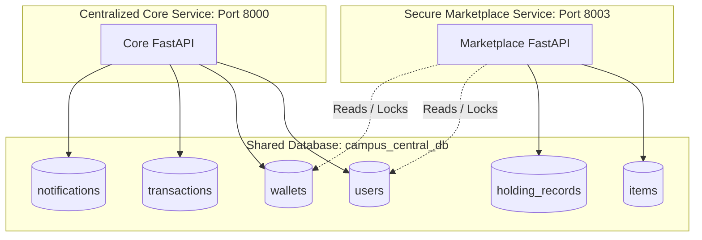

# Integration of Centralized Core and Secure Marketplace Services

This document details the architectural changes, component designs, and implementation steps completed to integrate the **Centralized Core** service (Port 8000) and **Secure Marketplace** service (Port 8003) with the shared database and the frontend React application.

---

## 1. Architectural Division of Labor

We decoupled the database models and operations to follow a clean, service-oriented structure:

1.  **Centralized Core (Port 8000)**: Owns the schemas and lifecycle of shared entities: users, admin users, wallets, transaction ledger, and notifications.
2.  **Secure Marketplace (Port 8003)**: Accesses the shared user and wallet tables strictly via raw parameter-safe SQL queries using row-level locks (`SELECT ... FOR UPDATE`) to manage escrow holdings, listings, and real-time chat rooms.

---

## 2. Decoupled Database Bootstrapping

*   **Core Bootstrapper (`backends/centralized_core/init_db.py`)**:
    *   Creates the database container `campus_central_db` if not exists.
    *   Calls SQLAlchemy `Base.metadata.create_all` to initialize all shared core tables.
    *   Seeds default manual verification students:
        *   **`student1`** (`Student A`, password: `password123`, **500.00** tokens).
        *   **`student2`** (`Student B`, password: `password123`, **500.00** tokens).
*   **Decoupled Marketplace Schema (`backends/marketplace/schema.sql`)**:
    *   Reverted to exclude duplicate core tables.
    *   Creates only marketplace-specific tables (`items`, `saved_items`, `holding_records`, `messages`, `user_reports`, `admin_activity_logs`).

---

## 3. Centralized Core Service Implementation

*   **Authentication & Session Management**:
    *   `passlib` with `bcrypt` hashes and verifies user passwords safely.
    *   `python-jose` issues stateless JWT access tokens containing user IDs.
*   **API Routers (`routers/auth.py`, `routers/wallet.py`, `routers/notifications.py`)**:
    *   Mounted directly in `main.py` without prefixes to align with the frontend axios routes:
        *   `POST /users/register`: Creates a student and inserts a default wallet.
        *   `POST /users/login`: Authenticates user credentials and issues a token.
        *   `GET /users/me`: Resolves active user profile details.
        *   `GET /wallet/balance`: Retrieves wallet details.
        *   `POST /wallet/topup`: Deposits tokens and registers a ledger log.
        *   `GET /wallet/history`: Returns transaction history.
        *   `GET /api/notifications`: Returns the domain-agnostic feed.
        *   `PATCH /api/notifications/{id}/read`: Marks a notification read.

---

## 4. Secure Marketplace Service Implementation

*   **Pessimistic Row-Level Locks (`services.py`)**:
    *   Uses transaction blocks (`conn.start_transaction()` / `conn.commit()`) to prevent race conditions during item escrow.
    *   Locks wallets and item rows using `FOR UPDATE` to protect against simultaneous double-purchasing.
*   **Real-time WebSocket Chat (`routers/chat.py`)**:
    *   Connection manager pools and broadcasts chat messages inside channels keyed by `item_id`.

---

## 5. Verification Test Suites

### A. Centralized Core integration tests (`backends/centralized_core/integration_test.py`)
Validates 8 core cases using FastAPI `TestClient`:
1.  Registration & auto-wallet creation.
2.  Login credential checks.
3.  Profile retrieval.
4.  Wallet balance checks & deposits topup logic.
5.  Ledger auditing & notification state toggling.

### B. Marketplace integration tests (`backends/marketplace/integration_test.py`)
Validates 5 transaction cases:
1.  Item listing.
2.  Escrow purchasing and wallet lockholds.
3.  Self-purchasing blocks.
4.  Insufficient balance blocks.
5.  Escrow releases to seller upon confirmation.
